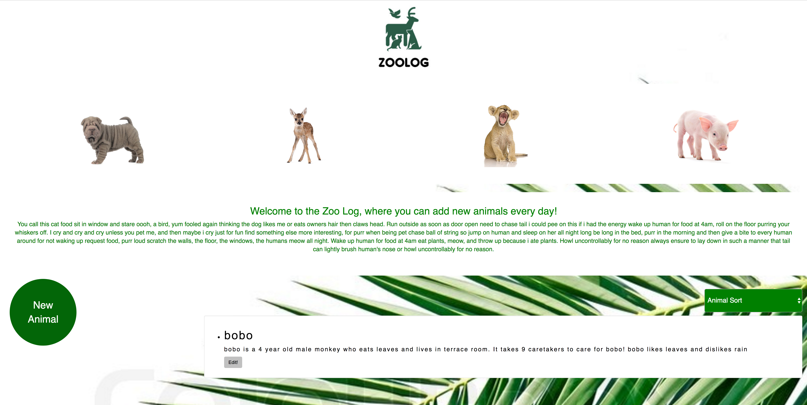
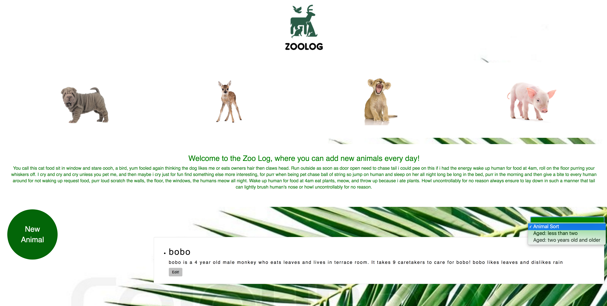

# Zoo Log App for the visually impaired

#### Epicodus Fall 2017

#### Author : Kate Byars

## Description

_An application which allows you to log animals in a zoo with easy readability for the visually impaired._

_The home page of the application, where you can read about the zoo._

_A form allows you to enter new animals into the zoo's log._

_Each record is displayed in large format for the visually impaired._

_Results are filtered using a select drop down._

_The project is made according to font specs for the visually impaired, such as those found here:http://www.afb.org/info/reading-and-writing/making-print-more-readable/35 _

## Setup/Installation Requirements
Bower, NPM and dependencies as listed in the files uploaded in this application.

* Clone this project from git hub
* install NPM
* initialize all the dependencies

## Specifications

| Behavior      | Example Input      | Example Output   |
| ------------- | ------------- | ------------- |
| I want to log a newly-admitted animal by submitting a form with animal species, name, age, diet, zoo location, number of needed caretakers, sex, one like and one dislike.|Bobo the monkey's information| A bullet point all about BoBo|
|I want to view a list of animals I have logged|Sort to All Animals in the sort select box|See all animals|
|I want options to view all animals, only young animals (less than 2 years of age), or only mature animals (2 years of age and older)|Select animals under two years old in the select box| See animals that are under two years|
|I want to click an animal to edit its name, age or caretakers.enter a new animal into the zoo's log and re| cancer  | a list of doctors and their info  |Click Edit|See a form that allows you to edit information|

## Inquiries ##
_katebyars5@gmail.com

## Known Bugs
_There are no known bugs_

## Futur Projects
_Add a map to display where the animals originate in the world, using Google API_
_Add an animal API to create dropdown selections for species and food type inputs
_Use animal API to create a photo url for display in the bio area, to show what each species looks like._

## Technologies Used

* _Atom_
* _Gulp_
* _Bower_
* _Karma_
* _Jasmine_
* _Angular_
* _APM Typescript_

### License

Copyright &copy; 2017 Kate Byars
